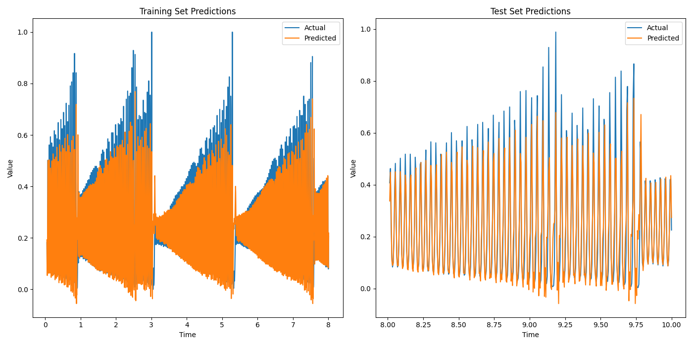
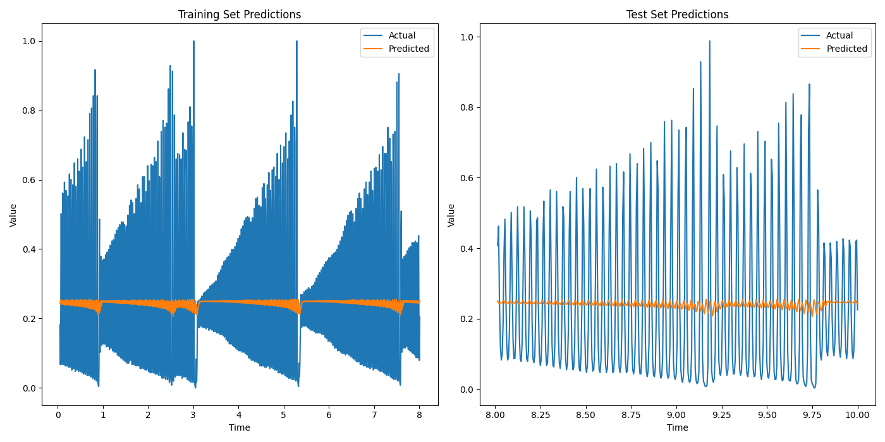
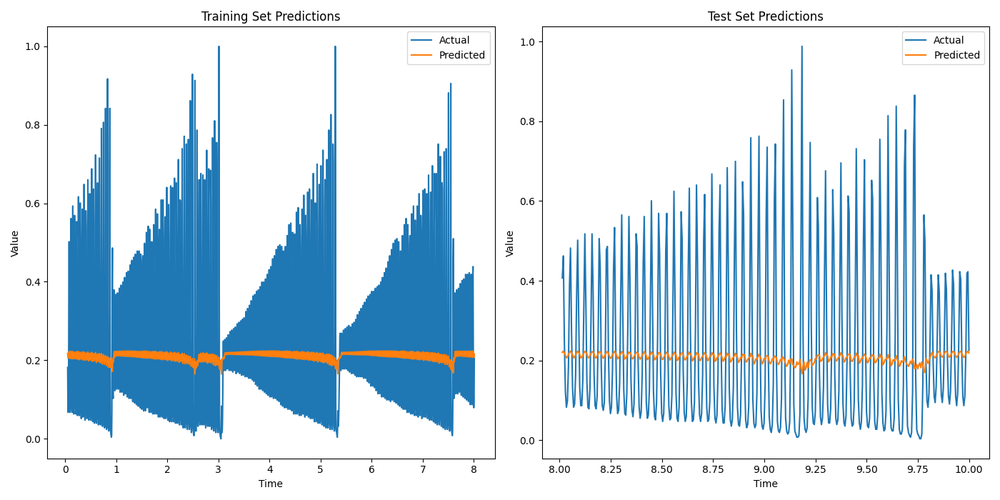
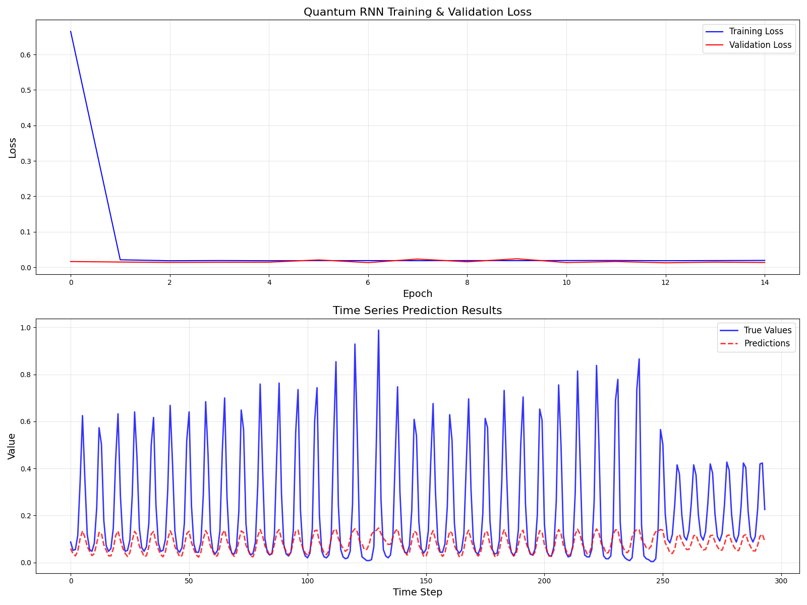

qubit_RNN: 一个类似RNN结构的pennylane量子电路。

single_qubit_circuit: 类RNN cell   
输入 params, input_val, hidden_state  
输出 hidden_state

circuit： 循环层+神经网络层  
循环层： n个cell  
神经网络层： (n, 4) (4, 1)  
输入：params, input_val  
输出：out

结果  

qubitDensityMatrix.py  
使用密度矩阵作为hidden_state  
核心代码：  

    def single_qubit_circuit(params, input_val, hidden_state):
        # 设置初始量子态（密度矩阵）
        qml.QubitDensityMatrix(hidden_state, wires=range(self.n_qubits_))

        # 输入编码
        qml.RY(input_val, wires=0)

        # 参数化层
        for layer in range(self.n_layers_):
            # 单量子比特旋转
            for i in range(self.n_qubits_):
                qml.RY(params[layer, i], wires=i)
            # 纠缠层
            for i in range(self.n_qubits_ - 1):
                qml.CNOT(wires=[i, i + 1])

        # 返回整个系统的密度矩阵
        return qml.density_matrix(wires=range(self.n_qubits_))

    self.circuit = single_qubit_circuit

    def circuit(params, input_seq):
        # 初始化隐藏态：|0><0|
        hidden_state = jnp.zeros((2 ** self.n_qubits_, 2 ** self.n_qubits_), dtype=jnp.complex64)
        hidden_state = hidden_state.at[0, 0].set(1.0)  # |0><0| 态

        for x in input_seq:
            # 执行量子电路获取演化后的密度矩阵
            rho = single_qubit_circuit(params["weights"], x, hidden_state)

            # hidden_state = rho
            reduced_rho = ptrace(rho, self.n_qubits_)

            # 创建新量子比特的初始态 |0><0|
            new_qubit_state = jnp.array([[1, 0], [0, 0]], dtype=jnp.complex64)

            # 克罗内克积扩展量子态
            hidden_state = jnp.kron(reduced_rho, new_qubit_state)

        # 输出转换（根据需求调整）
        output = self.output_transform(params, hidden_state)
        return output

问题：无法学到有效信息  
结果  
  

statePrep.py  
使用态矢量作为hidden_state  
核心代码： 

    def single_qubit_circuit(params, x, hidden_state):
        # 使用 StatePrep 设置初始纯态
        qml.StatePrep(hidden_state, wires=range(self.n_qubits_))
    
        # 改进的输入编码：缩放并作用于所有量子比特
        for i in range(self.n_qubits_):
            qml.RY(x, wires=i)
    
        # 增强的变分层
        for layer in range(self.n_layers_):
            for i in range(self.n_qubits_):
                qml.RX(params[layer, i, 0], wires=i)
                qml.RY(params[layer, i, 1], wires=i)
            for i in range(self.n_qubits_):
                for j in range(i + 1, self.n_qubits_):
                    qml.CNOT(wires=[i, j])
        # 返回演化后的态矢量
        return qml.state()
    
    self.circuit = single_qubit_circuit
    
    def circuit(params, input_seq):
        # 初始化隐藏态为 |0⟩ 的态矢量
        hidden_state = jnp.zeros(2 ** self.n_qubits_, dtype=jnp.complex64)
        hidden_state = hidden_state.at[0].set(1.0)  # |0⟩ 态
    
        for x in input_seq:
            # 执行量子电路获取演化后的态矢量
            state_vector = single_qubit_circuit(params["weights"], x, hidden_state)
            hidden_state = state_vector  # 更新隐藏态
    
        # 输出转换（根据需求调整）
        output = self.output_transform(params, hidden_state)
        return output
问题：无法学到有效信息  
结果  

test.py  
使用3个qubit，其中前2个为hidden_state,最后一个为input_value。每次取出前2个的偏迹作为hidden_state
核心代码： 

    def update_density_matrix(input_angle, hidden_rho, weights):
        """更新隐藏状态密度矩阵"""
        # 加载当前隐藏状态
        qml.QubitDensityMatrix(hidden_rho, wires=range(self.n_hidden_qubits))

        # 输入编码 (输入量子比特从隐藏量子比特之后开始)
        for i in range(self.n_input_qubits):
            qml.RY(input_angle, wires=self.n_hidden_qubits + i)

        # 应用参数化量子门 - 更强大的结构
        for layer in range(self.n_layers):
            # 旋转门
            for wire in range(self.n_total_qubits):
                phi, theta, omega = weights[layer, wire]
                qml.Rot(phi, theta, omega, wires=wire)

            # 灵活纠缠模式
            for i in range(0, self.n_total_qubits, 2):
                if i + 1 < self.n_total_qubits:
                    qml.CNOT(wires=[i, i + 1])
            for i in range(1, self.n_total_qubits - 1, 2):
                if i + 1 < self.n_total_qubits:
                    qml.CNOT(wires=[i, i + 1])

        # 返回更新后的隐藏状态
        return qml.density_matrix(wires=range(self.n_hidden_qubits))
    def quantum_rnn(input_sequence, init_hidden_rho, weights):
        """处理完整输入序列并输出预测值"""
        current_rho = init_hidden_rho

        # 迭代处理输入序列
        for angle in input_sequence:
            new_rho = self.update_density_matrix(angle, current_rho, weights)
            current_rho = self.validate_and_fix_density_matrix(new_rho)

        # 加载最终隐藏状态
        qml.QubitDensityMatrix(current_rho, wires=range(self.n_hidden_qubits))

        # 定义可观测量的加权组合作为单个测量期望值
        H = qml.Hamiltonian(
            [0.5, 0.3, 0.2],
            [qml.PauliZ(0), qml.PauliZ(1), qml.PauliZ(2)]
        )
        return qml.expval(H)
结果：  
